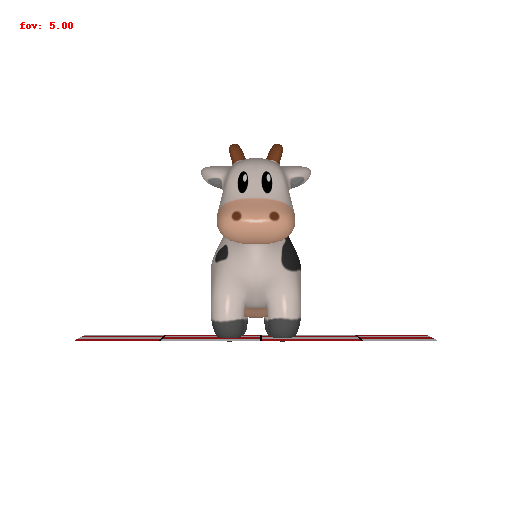
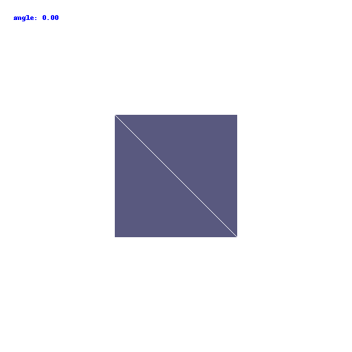
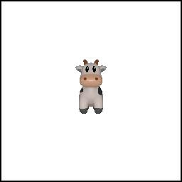
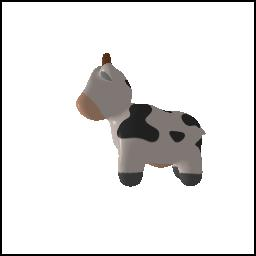
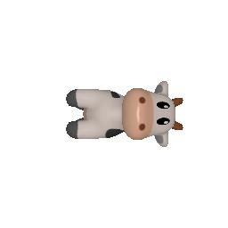
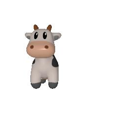
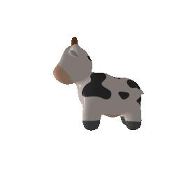
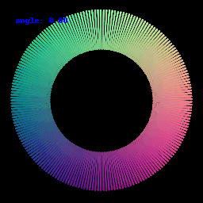

# 16-889 Assignment 1: Rendering Basics with PyTorch3D

**Chenhao Yang**

Goals: In this assignment, you will learn the basics of rendering with PyTorch3D, explore 3D representations, and practice constructing simple geometry. You may find it also helpful to follow the [Pytorch3D tutorials](https://github.com/facebookresearch/pytorch3d).


## 1. Practicing with Cameras

### 1.1. 360-degree Renders (5 points)


### 1.2 Re-creating the Dolly Zoom (10 points)

The [Dolly Zoom](https://en.wikipedia.org/wiki/Dolly_zoom) is a famous camera effect, first used in the Alfred Hitchcock film [Vertigo](https://www.youtube.com/watch?v=G7YJkBcRWB8). The core idea is to change the focal length of the camera while moving the camera in a way such that the subject is the same size in the frame, producing a rather unsettling effect.



## 2. Practicing with Meshes

### 2.1 Constructing a Tetrahedron (5 points)

In this part, you will practice working with the geometry of 3D meshes. Construct a tetrahedron mesh and then render it from multiple viewpoints.  Your tetrahedron does not need to be a regular tetrahedron (i.e. not all faces need to be equilateral triangles) as long as it is obvious from the renderings that the shape is a tetrahedron.

You will need to manually define the vertices and faces of the mesh. Once you have the vertices and faces, you can define a single-color texture, similarly to the cow in `render_cow.py`. Remember that the faces are the vertex indices of the triangle mesh.

It may help to draw a picture of your tetrahedron and label the vertices and assign 3D coordinates.

**On your webpage, show a 360-degree gif animation of your tetrahedron. Also, list how many vertices and (triangle) faces your mesh should have.**


There should be **4** vertices and **4** faces.

```python
vertices = torch.tensor([[math.sqrt(3),0,-1],[0,0,2],[-math.sqrt(3),0,-1],[0,3,0]])
faces = torch.tensor([[1,0,3],[3,2,1],[0,2,3],[0,1,2]])	
```


### 2.2 Constructing a Cube (5 points)

Construct a cube mesh and then render it from multiple viewpoints. Remember that we are still working with triangle meshes, so you will need to use two sets of triangle faces to represent one face of the cube.

**On your webpage, show a 360-degree gif animation of your cube. Also, list how many vertices and (triangle) faces your mesh should have.**



There should be **8** vertices and **12** faces.

```python
vertices = torch.tensor([[1.,0,1.],[1.,0.,-1.],[-1,0,-1],[-1,0,1],
  [1,2,1],[1,2,-1],[-1.,2.,-1.],[-1.,2.,1.]])

faces = torch.tensor([[1,0,2],[0,3,2],
                      [2,3,6],[7,6,3],
                      [1,4,0],[1,5,4],
                      [1,2,6],[1,6,5],
                      [0,4,7],[0,7,3],
                      [4,5,7],[4,6,7],
                      ])
```


## 3. Re-texturing a mesh (10 points)

Now let's practice re-texturing a mesh. For this task, we will be retexturing the cow mesh such that the color smoothly changes from the front of the cow to the back of the cow.

**In your submission, describe your choice of `color1` and `color2`, and include a gif of the rendered mesh.**


color of my choice:

```python
color1 = torch.tensor([0,0,1]) # blue
color2 = torch.tensor([1,1,1]) # white
```


## 4. Camera Transformations (20 points)

When working with 3D, finding a reasonable camera pose is often the first step to producing a useful visualization, and an important first step toward debugging.

Running `python -m starter.camera_transforms` produces the following image using the camera extrinsics rotation `R_0` and translation `T_0`:


What are the relative camera transformations that would produce each of the following output images? You shoud find a set (R_relative, T_relative) such that the new camera extrinsics with `R = R_relative @ R_0` and `T = R_relative @ T_0 + T_relative` produces each of the following images:

   

**In your report, describe in words what R_relative and T_relative should be doing and include the rendering produced by your choice of R_relative and T_relative.**


Since we are using `pytorch3d.renderer.FoVPerspectiveCameras()` for tranformation, we are changing the position of the camera. **R_relative** is the rotation matrix of the camera relative to it initial twist pose, it can be constructed either manually by 
$$
R_x = \begin{bmatrix}1&0&0\\
0&\cos \theta& -\sin \theta\\
0& \sin\theta&\cos\theta
\end{bmatrix}
$$

$$
R_y = \begin{bmatrix}\cos \theta &0&\sin \theta \\
0&1& 0\\
-\sin\theta&0&\cos\theta
\end{bmatrix}
$$

$$
R_z = \begin{bmatrix}\cos \theta &-\sin \theta&0 \\
\sin\theta&\cos\theta& 0\\
0&0&1
\end{bmatrix}
$$

Or using pytroch3d library:

```python
# example: rotate around y axis 90 degrees
relative_rotation = pytorch3d.transforms.euler_angles_to_matrix(
    torch.tensor([0, np.pi/2, 0]), "XYZ"
)
```


 **T_relative** is the translation matrix as in form of [x,y,z] realtive to the camera's initial position.

### 4.1

 ```Python
 R_relative=[[0, -1, 0], [1, 0, 0], [0, 0, 1]]
 ```



### 4.2

```python
T_relative=[0, 0, 1]
```


### 4.3

```python
T_relative=[0.5, 0, 0]
```



### 4.4

```python
rotate_angle = -90. / 180. * math.pi
R_relative=[math.cos(rotate_angle), 0, -math.sin(rotate_angle)], [0, 1, 0], [math.sin(rotate_angle), 0, math.cos(rotate_angle)]
T_relative=[-3., 0, 3]
```



## 5. Rendering Generic 3D Representations

### 5.1 Rendering Point Clouds from RGB-D Images (10 points)

In this part, we will practice rendering point clouds constructed from 2 RGB-D images from the [Common Objects in 3D Dataset](https://github.com/facebookresearch/co3d).


You should use the `unproject_depth_image` function in `utils.py` to convert a depth image into a point cloud (parameterized as a set of 3D coordinates and corresponding color values). The `unproject_depth_image` function uses the camera intrinsics and extrinisics to cast a ray from every pixel in the image into world  coordinates space. The ray's final distance is the depth value at that pixel, and the color of each point can be determined from the corresponding image pixel.

Construct 3 different point clouds:

1. The point cloud corresponding to the first image
2. The point cloud corresponding to the second image
3. The point cloud formed by the union of the first 2 point clouds.

Try visualizing each of the point clouds from various camera viewpoints. We suggest starting with cameras initialized 6 units from the origin with equally spaced azimuth values.

**In your submission, include a gif of each of these point clouds side-by-side.**

The point cloud corresponding to the first image:


The point cloud corresponding to the second image:


The point cloud formed by the union of the first 2 point clouds.


### 5.2 Parametric Functions (10 points)

**In your writeup, include a 360-degree gif of your torus point cloud, and make sure the hole is visible. You may choose to texture your point cloud however you wish.**



### 5.3 Implicit Surfaces (15 points)

**In your writeup, include a 360-degree gif of your torus mesh, and make sure the hole is visible. In addition, discuss some of the tradeoffs between rendering as a mesh vs a point cloud. Things to consider might include rendering speed, rendering quality, ease of use, memory usage, etc.**


Point cloud is generated by sampling from the parametric functions, it is easy to use. The sampling stage takes O(n) memory to store the points, for generating points, the memory usage depends on the number of parameters in the parametric functions (in torus example we have 2, so O(n^2)).  The rendering quality depends on the density of the points, and it will be sparse all the time, unlike meshes that we can map textures and shadings on.

In implicit surfaces, 

## 6. Do Something Fun (10 points)

Now that you have learned to work with various 3D represenations and render them, it is time to try something fun. Create your own 3D structures, or render something in an interesting way, or creatively texture, or anything else that appeals to you - the (3D) world is your oyster! If you wish to download additional meshes, [Free3D](https://free3d.com/) is a good place to start.

**Include a creative use of the tools in this assignment on your webpage!**

A helicopter rendered by mesh:


## (Extra Credit) 7. Sampling Points on Meshes (10 points)

We will explore how to obtain point clouds from triangle meshes. One obvious way to do this is to simply discard the face information and treat the vertices as a point cloud. However, this might be unresonable if the faces are not of equal size.

Instead, as we saw in the lectures, a solution to this problem is to use a uniform sampling of the surface using stratified sampling. The procedure is as follows:

1. Sample a face with probability proportional to the area of the face
2. Sample a random [barycentric coordinate](https://en.wikipedia.org/wiki/Barycentric_coordinate_system) uniformly
3. Compute the corresponding point using baricentric coordinates on the selected face.

For this part, write a function that takes a triangle mesh and the number of samples and outputs a point cloud. Then, using the cow mesh, randomly sample 10, 100, 1000, and 10000 points. **Render each pointcloud and the original cow mesh side-by-side, and include the gif in your writeup.\***


```python
def PCD_from_mesh(
    image_size=512,
    num_frames=100,
    duration=3,
    device=None,
    output_file="output/",
):
    if device is None:
        device = get_device()
    verts, faces, aux = pytorch3d.io.load_obj("data/cow.obj")
    
    verts, faces, aux = pytorch3d.io.load_obj("data/cow.obj")
    
    # print(faces.verts_idx)
    faces = faces.verts_idx
    # print(faces.verts_idx.shape)

    num_triangle = faces.shape[0]
    areas = torch.zeros((num_triangle))
    for i in range(num_triangle):
        v1 = verts[faces[i][0]][:]
        v2 = verts[faces[i][1]][:]
        v3 = verts[faces[i][2]][:]
        areas[i] = abs(0.5 * torch.inner(v1-v2, v1-v3))
    
    weight = areas / sum(areas)

    num_samples = 1000 # number of point cloud
    sampled_faceidx = []
    for i in range(num_samples):
      rnd = random.uniform(0, 1)
      for j, w in enumerate(weight):
          if w<0:
              raise ValueError("Negative weight encountered.")
          rnd -= w
          if rnd < 0:
              sampled_faceidx.append(j)
              break

    print("number of samples generated is:", num_samples)
    if num_samples != len(sampled_faceidx): raise ValueError("WTF?")

    points = torch.zeros((num_samples,3))
    for i in range(num_samples):
      idx = sampled_faceidx[i]
      p1, p2, p3 = verts[faces[idx][0]][:], verts[faces[idx][1]][:], verts[faces[idx][2]][:]
      alpha = random.uniform(0, 1)
      alpha2 = random.uniform(0, 1)
      alpha1 = 1- math.sqrt(alpha)
      v = alpha1 * p1 + (1-alpha1)*alpha2*p2 + (1-alpha1)*(1-alpha2)*p3
      points[i] = v

    color = (points - points.min()) / (points.max() - points.min())
    cow_point_cloud = pytorch3d.structures.Pointclouds(
        points=[points], features = [color]
    ).to(device)

    renders = []
    angles = np.linspace(0,360,num_frames)
    for i, angle in enumerate(tqdm(angles)):
        R, T = pytorch3d.renderer.look_at_view_transform(dist=5.0, elev=2, azim=angle)
        cameras = pytorch3d.renderer.FoVPerspectiveCameras(R=R, T=T, device=device)
        renderer = get_points_renderer(image_size=image_size, device=device)
        rend = renderer(cow_point_cloud, cameras=cameras)
        rend = rend.cpu().numpy()[0, ..., :3]  # (B, H, W, 4) -> (H, W, 3)
        renders.append(rend)

    images = []
    for i, r in enumerate(renders):
        image = Image.fromarray((r * 255).astype(np.uint8))
        draw = ImageDraw.Draw(image)
        draw.text((20, 20), f"angle: {angles[i]:.2f}", fill=(0, 0, 255))
        images.append(np.array(image))
    imageio.mimsave(output_file, images, fps=(num_frames / duration))
```

