# 16-889 Assignment 2: Single View to 3D

Goals: In this assignment, you will explore the types of loss and decoder functions for regressing to voxels, point clouds, and mesh representation from single view RGB input. 

## 1. Exploring loss functions
This section will involve defining a loss function, for fitting voxels, point clouds and meshes.

### 1.1. Fitting a voxel grid
**Optimized voxel grid:**

Note that there's no direct rendering method for voxels in `pytorch3d`, the voxel was first transformed to mesh by `pytorch3d.ops.cubify` and then rendered by mesh render.

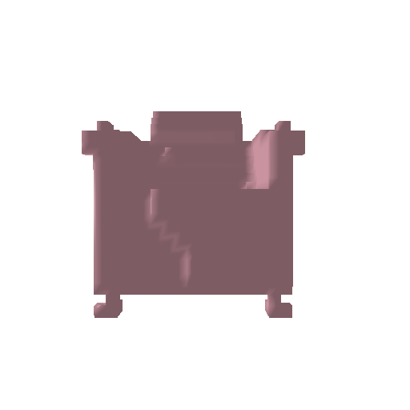

**Ground Truth voxel:**

### 1.2. Fitting a point cloud (10 points)
**Optimized point cloud:**

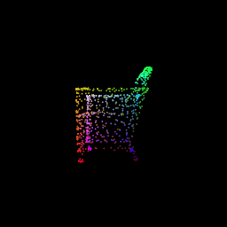

**Ground Truth:**

### 1.3. Fitting a mesh
In this subsection, we will define an additional smoothening loss that can help us <b> fit a mesh</b>.

**Optimized mesh:**

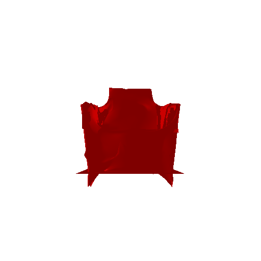

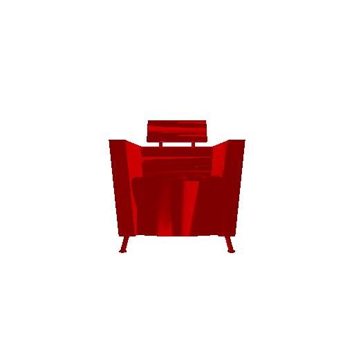

## 2. Reconstructing 3D from single view

This section involves training a single view to 3D pipeline for voxels, point clouds and meshes.

### 2.1. Image to voxel grid
---
### Decoder:
In order to transfer information of 2D feature maps into 3D volumes. I designed a network structure which is similar to Pix2Vox-F. There are four 3D transposed convolutional layers. In detail, the first three 3D transposed convolutional layers are of a kernel size of $4^3$, with stride of 2 and padding of 1. Each transposed convolutional layer is followed by a batch normalization layer and a ReLU activation except for the last layer followed by a sigmoid activation layer. The numbers of output channels of the transposed convolutional layers are 64, 32, 8, and 1, respectively.

### Results:

From left to right: RGB image input for prediction, predicted voxel, ground truth mesh

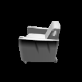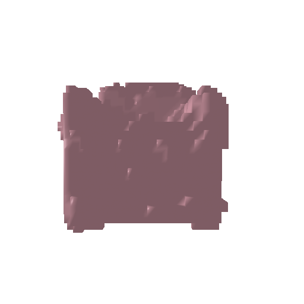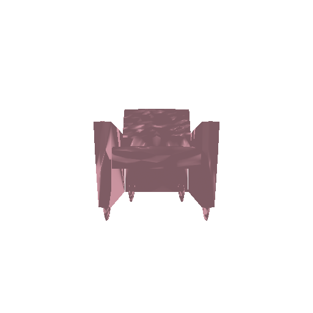

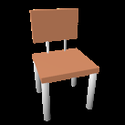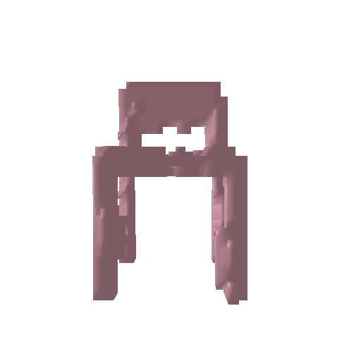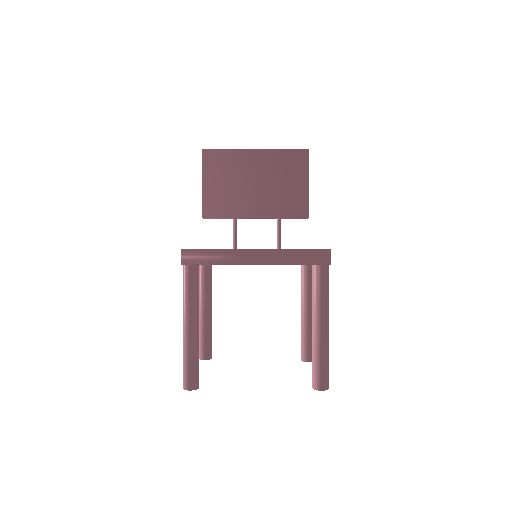

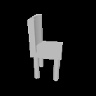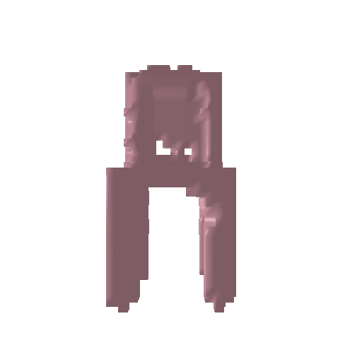

### 2.2. Image to point cloud (15 points)

---
### Decoder:

The decoder for generating 3D point cloud I designed contains four 2D transposed convolution layer followed by a fully connected layer that has size $(num\;of\;points)\times3$ and then reshaped to point cloud coordinates. There are batch normalization layers between transposed convolution layers and I used `Tanh` for activation.  

### Results:
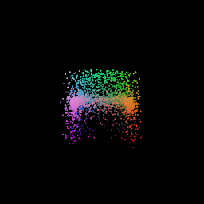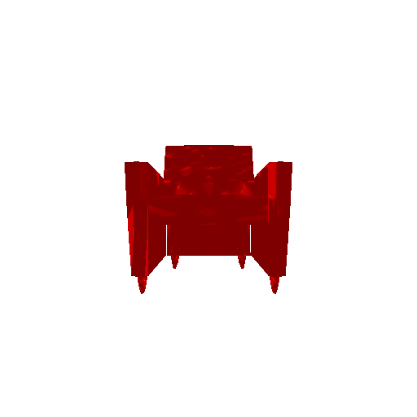

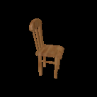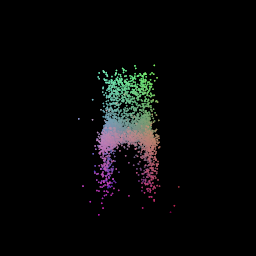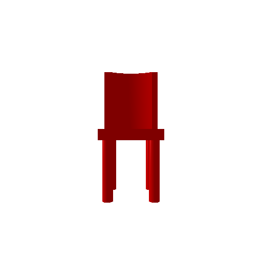

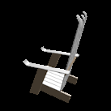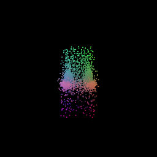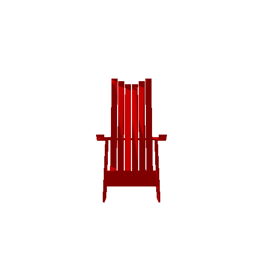

### 2.3. Image to mesh (15 points)
---
### Decoder:

The decoder structure I implemented for this network is simply four fully-connected layers followed by `Tanh` activation layer. The number of feature for each layer is `[512, 1024, 2048, 4096]` and outputs $(num\;of\;points)\times3$. The training was made for deforming vertices instead of directly on vertices coordinates.

### Results:

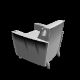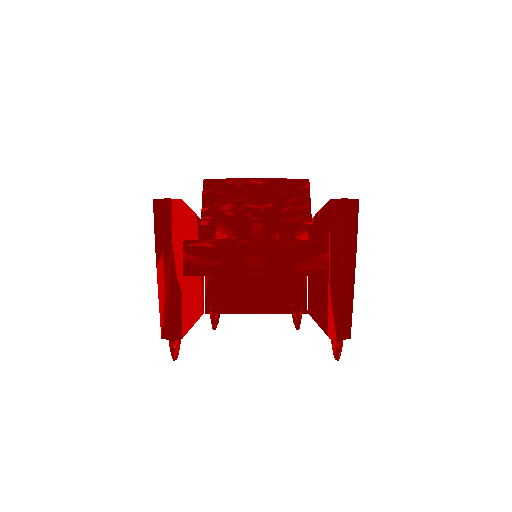

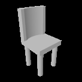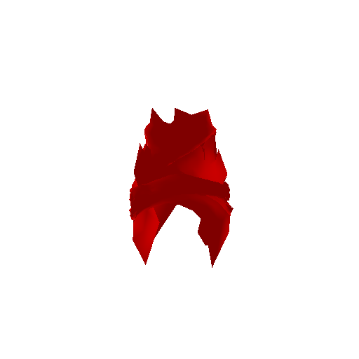

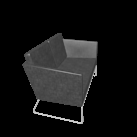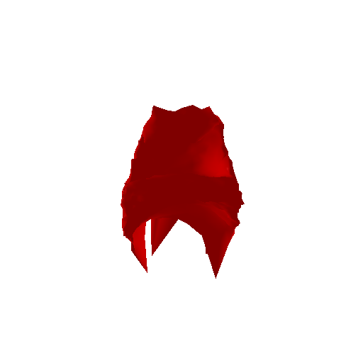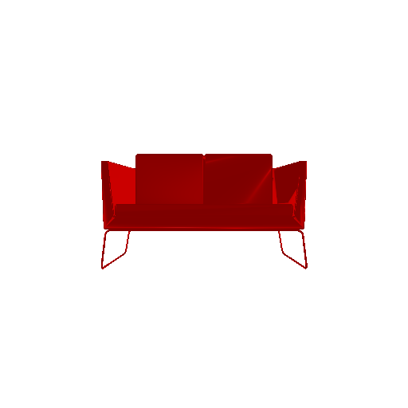

### 2.4. Quantitative comparisions(10 points)

Quantitatively compare the F1 score of 3D reconstruction for meshes vs pointcloud vs voxelgrids.
Provide an intutive explaination justifying the comparision.

| Presentation | Loss  | F-score@0.05 |
| :----------: | :---: | :----------: |
|    voxel     | 0.162 |    64.588    |
|  pointcloud  | 0.001 |    91.042    |
|     mesh     | 0.010 |    81.547    |

Generally, we can find that F-score is proportional to the loss during training and F-score of `point cloud` > `mesh` > `voxel`. There can be two possible reasons for this: 
* Why `voxel`<`pc & mesh` : We directly used chamfer loss to optimize point cloud and mesh but binary cross entropy loss for voxel, and F1 score is measuring the closeness of predicted points and ground truth. Such that, it may not be a friendly indicator for voxels; Also, because of the sampling method for voxel and it is too small (32x32x32), it may not be accurate enough.
* Why `pc` > `mesh` : though not too much difference, `pc` get higher score because `mesh` was trained using combined loss(chamfer and smooth), higher weight of smooth loss typically reduces F-score (as experimented and explained in the next section).

### 2.5. Analyse effects of hyperparms variations (10 points)

In this section, I analyzed the effect of `w_chamfer` (weight of chamfer loss) on the training results.

| w_smooth | w_chamfer | Loss  | F-score@0.05 |
| :------: | :-------: | :---: | :----------: |
| 1       |    0.1    |  0.012  |  38.059   |
| 1       |    0.5    |  0.012  | 68.350  |
| 1       |    1    |  0.014  | 73.853 |
| 1       |    10    |  0.054  | 74.512  |
| 1       |    50    |  0.220  | 79.452  |

**For consistancy, each model was trained with 100 iteration and using same parameters**

The initial ratio of w_smooth and w_chamfer was 0.1, which is too small in my belief, because the generated chair mesh was spiky. Incresing weight of smooth loss intuitively makes the surface flatter, so I set w_smooth to 1.2 in final presentation. In this section, I further explored the effect of ratio of w_smooth and w_chamfer in order to get more understandings. As listed in the table, we can notice that higher w_chamfer makes F-score better, but not necessarily the visual results. This is because F-score is computed similar to chamfer loss, or at least more related, so we can see it gives more rewards to higher w_chamfer/w_smooth ratio model. However, such model may not have a good visual presentation. To conclude, we still lack of a single evaluating metric that can be both need both qualitative and quantitative for mesh generated, it is worth to be developed.

### 2.6. Interpret your model

One feature worth to be added on is to visualize the **likelihood** of our predicted voxel if possible, so we can see distribution of the probability and better our model. To implement this idea, I created groups of voxels that are in same range of likelihood (e.g. between 0.1 and 0.2 as one group, 0.2~0.3 another and so on), give them textures of different colors and render them together in the same picture. Details are in `visualize.visualize_voxel_likelyhood()` , I used `pytorch3d.ops.cubify` to turn voxel to meshes and `pytorch3d.structures.join_meshes_as_scene` for concatenating meshes. I chose color from **red** to **blue** as indicator of likelihood from **high** to **low**.

Visualizations of my previous trained predictions using voxels are below:

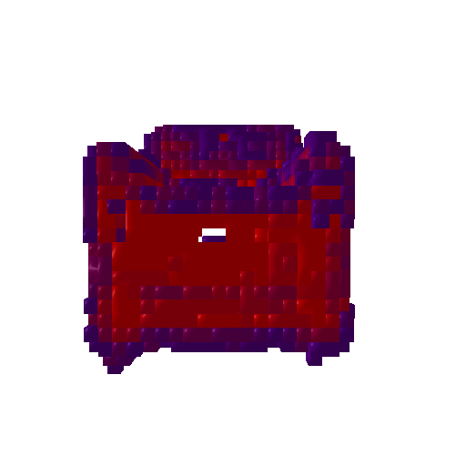

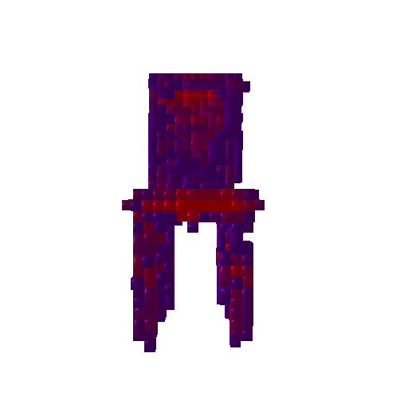

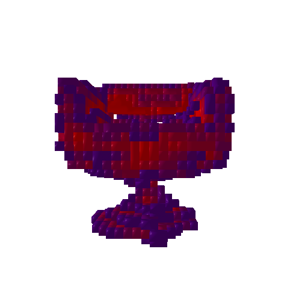

This way, we can easily find out that boundaries of the chair typically have lower likelihood and inners have higher likelihood.

---
