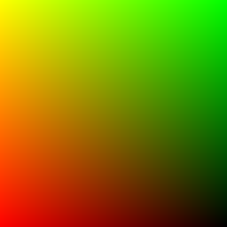
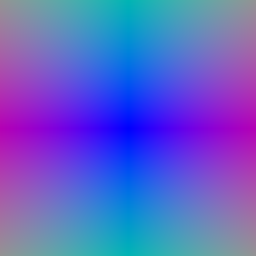
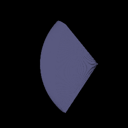
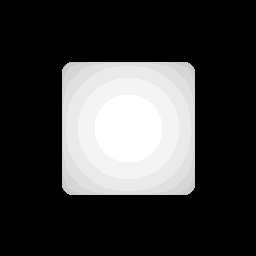
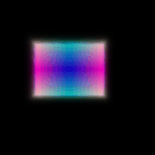
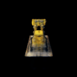
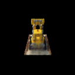
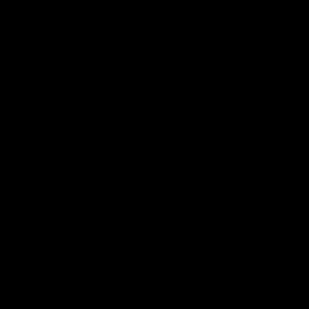

Assignment 3
===================================

Chenhao Yang 

yangchenhao@cmu.edu

##  1. Differentiable Volume Rendering

In the emission-absorption (EA) model that we covered in class, volumes are described by their *appearance* (e.g. emission) and *geometry* (absorption) at *every point* in 3D space. For part 1 of the assignment, you will implement a ***Differentiable Renderer*** for EA volumes, which you will use in parts 2 and 3. Differentiable renderers are extremely useful for 3D learning problems --- one reason is because they allow you to optimize scene parameters (i.e. perform inverse rendering) from image supervision only!


Ray sampling results:






Point samples:



Visualization of my depth:



Depth is extracted by nearest non-zero point in density.

##  2. Optimizing a basic implicit volume

Reference output:


My output:

The box center was: [0.25, 0.25, 0.00]. The side length was: [2.00, 1.50, 1.50]



##  3. Optimizing a Neural Radiance Field (NeRF) (30 points)

In this part, you will implement an implicit volume as a Multi-Layer Perceptron (MLP) in the `NeuraRadianceField` class in `implicit.py`. This MLP should map 3D position to volume density and color. Specifically:

1. Your MLP should take in a `RayBundle` object in its forward method, and produce color and density for each sample point in the RayBundle.
2. You should also fill out the loss in `train_nerf` in the `main.py` file.

You will then use this implicit volume to optimize a scene from a set of RGB images. We have implemented data loading, training, checkpointing for you, but this part will still require you to do a bit more legwork than for Parts 1 and 2. You will have to write the code for the MLP yourself --- feel free to reference the NeRF paper, though you should not directly copy code from an external repository.

## Visualization


##  4. NeRF Extras (***Choose at least one!*** More than one is extra credit)

###  4.1 View Dependence (10 pts)

Add view dependence to your NeRF model! Specifically, make it so that emission can vary with viewing direction. You can NeRF or other papers for how to do this effectively --- if you're not careful, your network may overfit to the training images. Discuss the trade-offs between increased view dependence and generalization quality.




View dependence can be added to training by setting `use_dir` to `True` in `nerf.yaml`, I used shared code block for training part 3 and part 4.1.

With added view dependence (direction of the rays), the results improved (both visual and loss) with same training parameters and epochs. View dependence can results over-fitting to certain view in the training data, however, for a volumetric rendering task, the predicted density is not view-dependent. So we can use seperated prediction heads for predicting density and color. For density, input includes view dependence and position of ray; for color, only use position.


###  4.3 High Resolution Imagery (10 pts)

Run NeRF on high-res imagery using the `nerf_lego_highres.yaml` config file. This will take a long time to train -- play around with some hyper parameters (point samples per ray, network capacity) and report your results


run by 

```shell
python main.py --config-name=nerf_lego_highres
```

During training, I found that increasing point samples per ray can improve the result(but increases training computations), so I set it as `512`. 


