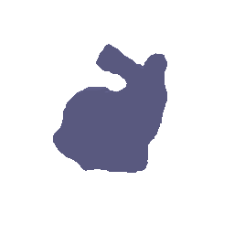
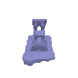
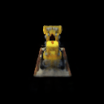
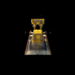

Assignment 4
===================================

##  1. Sphere Tracing (30pts)

To implementation sphere tracing, I used iterative method for the ray marching, here's the pesudo code:

While(f(p)>epsilon):
    t = t + f(p)
    p = origin + t*directions

The reason why we never cross the surface is because the distance between point p to hit surface is always larger than the distance between point p to clostest surface, unless the ray happen to be normal of hitting point surface which is very rare.
To compute the mask, I used the fact that the ray always proceed and will go to distance larger than our `far` threshold ultimately if it does not hit the surface. So once the marched distance `t` larger than this threshold, I consider it as False in the mask.

##  2. Optimizing a Neural SDF (30pts)

The input to the neural network was point clouds sampled on the object, and outputs signed difference with respect to the object. Therefore, GT of the output should just be zeros. During implementation, I used a 6 hidden MLP layers with 128 neurons for each.

Eikonal loss was to enforce gradient of SDF respect to x to have norm of 1 as a regulation term, mathematically speaking:
$$
L_{reg} = \frac{1}{N}\sum(||\nabla_{x_i} f(x_i;\theta)||_2-1)^2\\
$$
$Where\,x_i\in X \; point\;cloud, \theta\;is\;learning\;parameters.$

The loss encourages the coordinate-based network to predict the closest offset to surface instead of arbitary values for points in space.

Point cloud used for training:

Prediction of my network:

##  3. VolSDF (30 pts)

Signed difference function to density:
$$
\sigma(x)= \alpha \Psi_\beta(-d(x))\\
\alpha \Psi_\beta(s) =\left\lbrace \begin{array}{l}

0.5\;\mathrm{exp}(\frac{s}{\beta}) \quad\quad s <=0\\
1- 0.5\;\mathrm{exp}(-\frac{s}{\beta})\quad s>0\\
\end{array}\right.
$$

1. intuitive explanation of what the parameters `alpha` and `beta` are doing. 

   `alpha` controls the overall density, it is a scale term in front of the function;

   `beta` controls the smoothing amount, meaning how density is sensitive to distance changes, if `beta` approaches zero, the density close to the surface would change dramatically.

2. How does high `beta` bias your learned SDF? What about low `beta`?

   High `beta` results density less sensitive near surface and the rendering would be more blurred. On the contrary, low `beta` results density highly sensitive near surface such that the surface presentation is more accurately extracted.

3. Would an SDF be easier to train with volume rendering and low `beta` or high `beta`? Why?

   There's no single direction: Right `beta` would make SDF easier to train. Generally, high beta would make training and volume rendering more stable, as sharp transition from empty to occupied space would be mitigated. However, the exact surface would be well-extracted and optimized. On the other hand, low `beta` results too small margin for surface have nonzero density, so the volume rendering and training may be harder. So there's some better `beta` lying between.

4. Would you be more likely to learn an accurate surface with high `beta` or low `beta`? Why?

   An accurate surface would be more likely to be learning by a low `beta`. Because the density function in this case converges to a scaled indicator function, as density close to surface would be $0.5\alpha$ and zeros elsewhere.

Model rendered with best parameters I chose:

 

## 4. Neural Surface Extras

### 4.2 Fewer Training Views
During my implementation, I randomly chose 20 images for training, VolSDF was trainable and showed fair results:

As a comparison, using same set of training samples, Nerf was not able to converge and resulted empty:

In order to check the minimum pictures need for nerf to generate reasonable results, I gradually increased the samples to **85** to get the renderings under the same set of parameter settings.

We can conclude that VolSDF needs less training views than nerf. The reason behind this could be VolSDF is to train the implicit SDF, and then density is calculated afterwards. The information that needed to learn is much less.

### 4.3 Alternate SDF to Density Conversions
In Q3, we used the equations from [VolSDF Paper](https://arxiv.org/pdf/2106.12052.pdf) to convert SDF to density. You should try and compare alternate ways of doing this e.g. the ‘naive’ solution from the [NeuS paper](https://arxiv.org/pdf/2106.10689.pdf), or any other ways that you might want to propose!

In this section, I used the 'naive' solution from the NeuS paper:
$$
\phi_s(x) = \frac{se^{-sx}}{(1+e^{-sx})}
$$
Implementation is in `sdf_to_density_naive`, and I chose scale parameter `s=150`

which gives me results:

