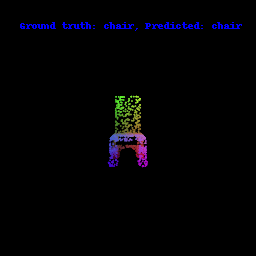
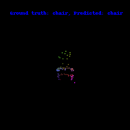

 ## Overview
In this assignment, I implemented a PointNet based architecture for classification and segmentation with point clouds.

## Q1. Classification Model
- test accuracy of my best model: 95.278%

<!-- - visualize a few random test point clouds and mention the predicted classes for each. Also visualize at least 1 failure prediction for each class (chair, vase and lamp),  and provide interpretation in a few sentences.   -->

- successful predictions:


- failed predictions:


The classification for these three classes generally yield good results. Among all failed predictions in test dataset, 46% of samples are falsely predicted as vase and 54% as lamp. However, none of them are falsely predicted as chair. This could be resulted from similar geometry shared by lamp and vase, as they are both round and sometimes hard to differentiate without texture.

## Q2. Segmentation Model
- test accuracy of my best model: 89.5322%

- visualize segmentation results of at least 5 objects (including 2 bad predictions) with corresponding ground truth, report the prediction accuracy for each object, and provide interpretation in a few sentences.
- successful cases:

left: ground truth; right: predicted.


- failed cases:


## Q3. Robustness Analysis
### Testing of model robustness with various number of points
 - procedure: test with different number of sampled points when evaluating.
    - visualization:
    1000 pts:
    
    100 pts:
    
    10 pts:
    
    1 pt:
    

 - results:
    - classification

        |number of points | accuray |
        |---|---|
        |10000| 95.2780%|
        |1000| 84.8899%|
        |100| 83.9454%|
        |10| 64.4281%|
        |1| 28.4365%|

    - segmentation

        |number of points | accuray |
        |---|---|
        |10000| 89.5322%|
        |1000| 88.4906%|
        |100| 73.6709%|
        |10 |45.8184%|
        |1 |32.0907%|

### Testing of model robustness with noise
- procedure: adding gaussian noise with zero mean and different standard deviation $\sigma$ to test data
```
torch.normal(mean=0, std = 0.01 * torch.ones_like(test_data))
```

Visualization of noise added:


- results
    - Classification:
        | sigma | accuracy |
        |---|---|
        | 0.0 | 95.2780%|
        | 0.01 | 95.2781%|
        | 0.05 | 93.9139%|
        | 0.1 | 90.2413%|
        | 0.5 | 69.1501%|
        | 1.0 | 55.2991%|

    - Segmentation:
        | sigma | accuracy |
        |---|---|
        | 0.0 | 89.5322%|
        | 0.01 | 87.9162%|
        | 0.05 | 81.4656%|
        | 0.1 | 67.7958%|
        | 0.5 | 41.8120%|
        | 1.0 | 37.8610%|


## Q4. Bonus Question - Locality (20 points)
Incorporate certain kind of locality as covered in the lecture (e.g. implement PointNet++ or DGCNN, etc).

Deliverables: On your website, 

- specify the model you have implemented
- for each task, report the test accuracy of your best model, in comparison with your results from Q1 & Q2
- visualize results in comparison to ones obtained in the earlier parts
