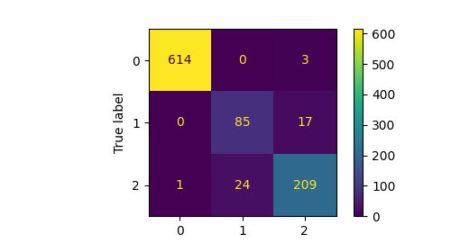

 ## Assignemnt5: PointNet

Chenhao Yang

yangchenhao@cmu.edu

In this assignment, I implemented a PointNet based architecture for classification and segmentation with point clouds.

## Q1. Classification Model
- test accuracy of my best model: 95.278%

- successful predictions:


- failed predictions:


Confusion matrix:


The classification for these three classes generally yield good results. We can interperate from confusion matrix that vase and lamp are easy to get false prediction while chair generally predicts well. This could be resulted from similar geometry shared by lamp and vase, as they are both round and sometimes hard to differentiate even for human without texture information. One more finding is that we noticed the unbalanced testing/training data as chair class are much larger than the rest of the classes, this may afftected our results as well.

## Q2. Segmentation Model
- test accuracy of my best model: 89.5322%

- visualize segmentation results of at least 5 objects (including 2 bad predictions) with corresponding ground truth, report the prediction accuracy for each object, and provide interpretation in a few sentences.
- successful cases:

left: ground truth; right: predicted.


- failed cases:


## Q3. Robustness Analysis
### Testing of model robustness with various number of points
 - procedure: test with different number of sampled points when evaluating.
    - visualization:
    1000 pts:
    
    100 pts:
    
    10 pts:
    
    1 pt:
    

 - results:
    - classification

        |number of points | accuray |
        |---|---|
        |10000| 95.2780%|
        |1000| 84.8899%|
        |100| 83.9454%|
        |10| 64.4281%|
        |1| 28.4365%|

    - segmentation

        |number of points | accuray |
        |---|---|
        |10000| 89.5322%|
        |1000| 88.4906%|
        |100| 73.6709%|
        |10 |45.8184%|
        |1 |32.0907%|
        
        As stated in PointNet paper, the model has robustness to sampling, becasue the global feature still extractable with resuced sampled points.

### Testing of model robustness with noise
- procedure: adding gaussian noise with zero mean and different standard deviation $\sigma$ to test data
```
torch.normal(mean=0, std = 0.01 * torch.ones_like(test_data))
```

Visualization of noise added:

0.01


0.05


0.1


0.5


1.0


- results
    - Classification:
        | sigma | accuracy |
        |---|---|
        | 0.0 | 95.2780%|
        | 0.01 | 95.2781%|
        | 0.05 | 93.9139%|
        | 0.1 | 90.2413%|
        | 0.5 | 69.1501%|
        | 1.0 | 55.2991%|

    - Segmentation:
        | sigma | accuracy |
        |---|---|
        | 0.0 | 89.5322%|
        | 0.01 | 87.9162%|
        | 0.05 | 81.4656%|
        | 0.1 | 67.7958%|
        | 0.5 | 41.8120%|
        | 1.0 | 37.8610%|
        
        Surprisingly, PointNet still preserves certain classification and segmentation capability with heavy noise contamination. For instance, with STD equals 0.5, it's already nearly impossible for human to classify the models while PointNet still able to classify with nearly 70% accuracy. Therefore, we can conclude that PointNet is robust with gaussian noises.s
